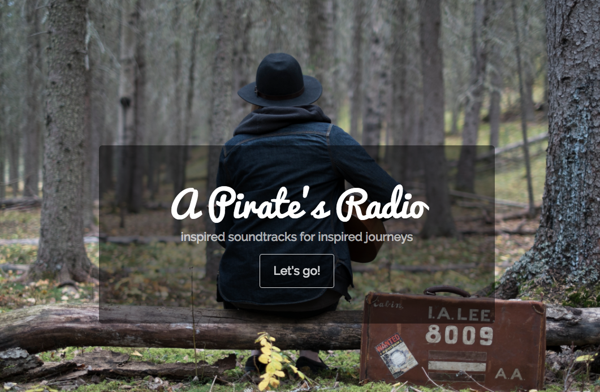
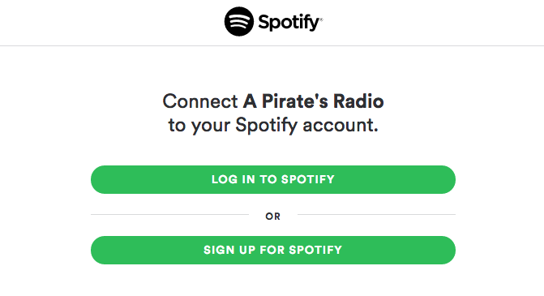
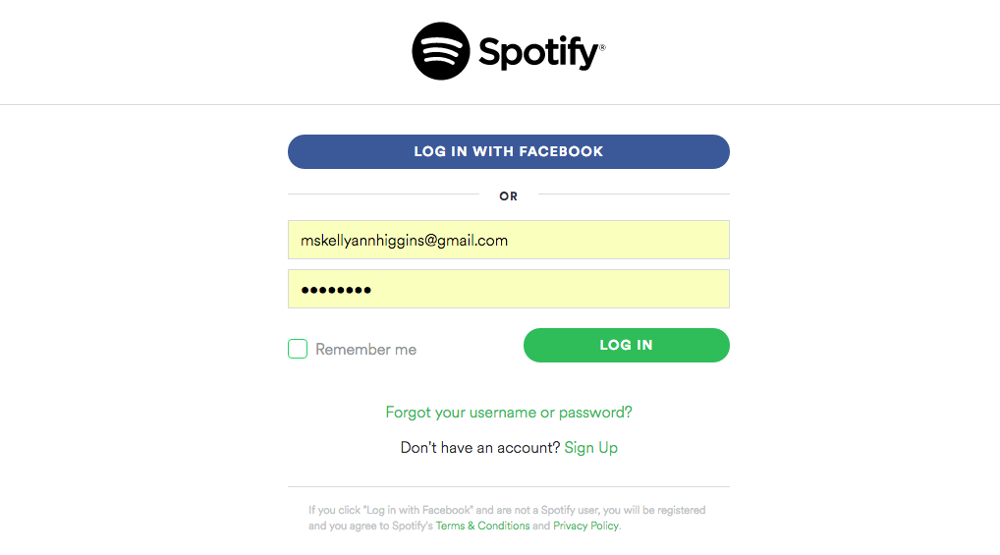
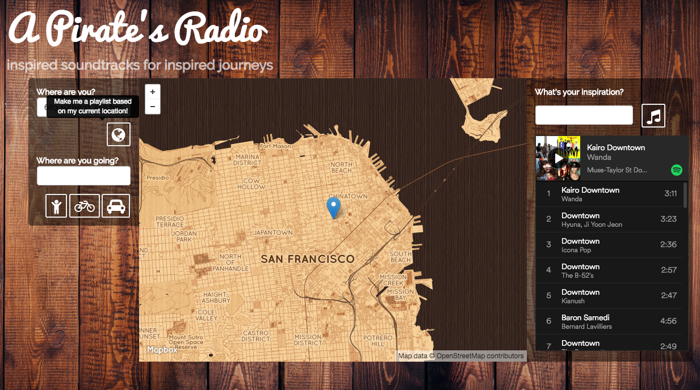
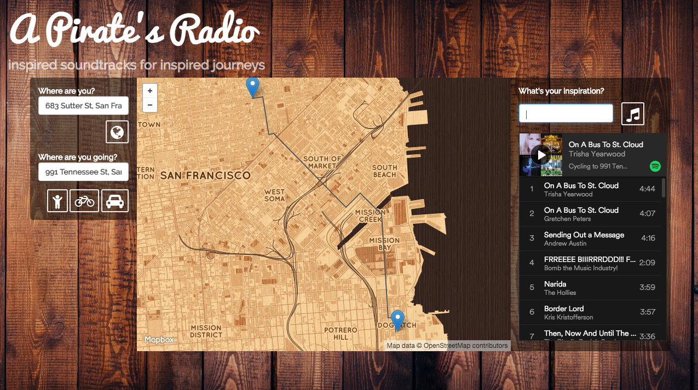
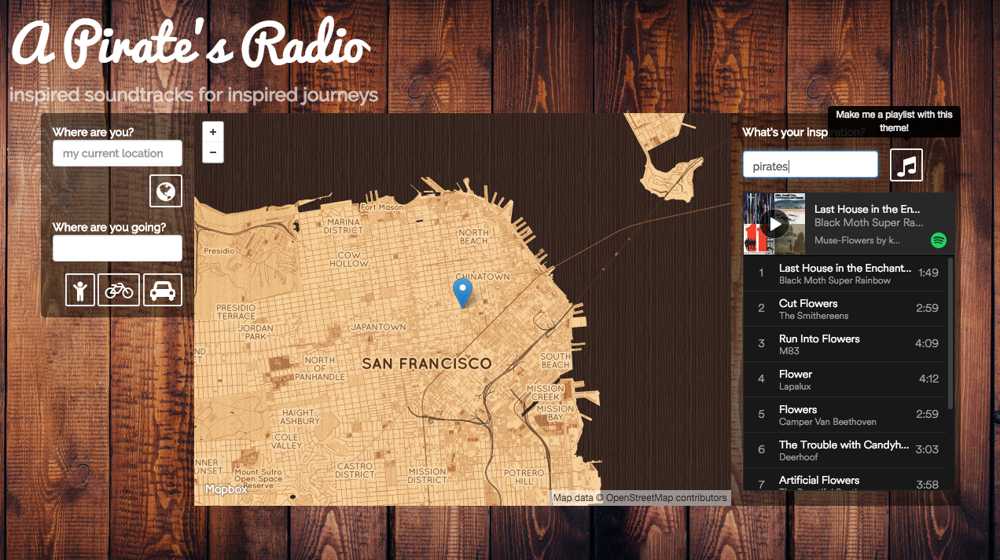

A Pirate's Radio
================

To learn about the pirate behind the radio: www.linkedin.com/in/kellyannhiggins

Every journey has a story, and in the nooks and crannies of every place hides hidden inspiration. The streets and neighborhoods around us have inspired stories immortalized in song. A Pirate's Radio features music about the place where you are, and the places you're going. A voyager can log in with their Spotify account, and with the click of a button have a playlist generated for them based on their current location, or a journey by car, bike, or foot. If you want to build your own custom playlist, the Pirate's Radio Muse will build you a playlist around any subject appearing in the lyrics. 

The playlists are saved to your Spotify account, and your personal Pirate's Radio is ready to be taken on any adventure you dare! 

A Pirate's Radio was built by Kelly Higgins, a former eco-pirate who lived aboard Sea Shepherd's flagship for four years, battling poachers from Antarctica, to the North Atlantic, to the South Pacific. A Pirate's Radio was inspired by the playlists Kelly and the crew would make while sailing the seas, trying to find songs about the islands and landmarks where their journeys took them. Kelly wanted to share that inspiration into people's everyday trips, to unlock a deeper appreciation of the places on our journeys, large and small.

## Table of Contents
* [Technologies Used](#technologiesused)
* [APIs Used](#apis)
* [Back End](#back)
* [Front End](#front)
* [User Experience](#ux)
* [About the Developer](#developer)

## Technologies Used
* Javascript
* [Python](https://www.python.org/)
* [Flask](http://flask.pocoo.org/)
* [Flask - SQLAlchemy](http://flask.pocoo.org/)
* [jQuery](https://jquery.com/)
* [Jinja2](http://jinja.pocoo.org/docs/dev/)
* [Bootstrap](http://getbootstrap.com/2.3.2/)
* [PostgreSQL](https://www.postgresql.org/)
* HTML5
* CSS3
* AJAX/JSON

## APIs Used

* [Musixmastch](https://musixmatch.com/)
* [Spotify](https://developer.spotify.com)
* [Mapbox](https://www.mapbox.com/developers)
* [Mapbox Geocoder](https://www.mapbox.com/geocoding)
* HTML5 Geolocation

## Back End

A Pirate's Radio is a web app written in Python and built on Flask. API keys are stored in a secrets file and sourced from the OS environment. Flask's OAuth library is used to engage with Spotify's API to authenticate user credentials and retrieve an access token for the session via redirecting users to Spotify to log in, and back once authentication is successful. 

Kelly wrote a function called Muse to serve as the base of A Pirate's Radio. It takes a keyword and sends a request to Musixmatch, the largest database of song lyrics on the internet, with thousands of songs being added every day. A request is sent on behalf of the Spotify user to create their new custom playlist. From that response, a playlist ID is returned, and another request is sent to add tracks to the playlist.

The geographic features of A Pirate's Radio use different facets of Mapbox's API. To create a playlist about a location, a query is sent to the Mapbox geocoder for names related to where the user is - street name, neighborhood, city, and state. These place names are then fed to the Pirate's Muse to create a playlist of songs with those names in the lyrics.

To create a playlist based upon a journey, A Pirate's Radio sends a query to the Mapbox API with the origin name, destination name, and the routing method - a walk, bikeride, or drive. From each waypoint along the journey, place names are collected to be given to the Pirate's Muse. Thus, the voyager has a playlist about not just where they are and where they are going, but all the places they'll go along the way.

## Front End

A Pirate's Radio is built on HTML5 and CSS3 with some help from Bootstrap. HTML5's Geolocation function is executed in JavaScript when the user arrives to retrieve their position. The map on the page will respond by dropping a pin on the user's location, and changing the view to be centered around the location pin. If the user chooses to not share their location with the browser, the pin and location will be on Hackbright Academy on Sutter Street in San Francisco. 

When the user enters their word of inspiration into the Pirate's Muse, a post request is sent to the back end to run the Muse function. Jinja returns the playlist id to change the embedded playlist on the page into the one that the user has just created.

When the user clicks the button to build a playlist on their current location, their latitude, longitude and any information that they have entered into the origin field are sent via an AJAX request to generate and display their location playlist on the page.

To create a journey playlist, the user enters their origin and destination, and selects their routing by clicking on a walking, biking, or driving icon. These three values are sent via an AJAX request that returns their journey playlist, and a GEOJSON directions object, which is then rendered by Mapbox, and pins are placed at the start and end of their trip. If the user makes a new playlist for another journey, the pins and route are cleared to display the new route.

All playlists created by A Pirate's Radio are saved to the Spotify account of the logged in user to be enjoyed on their mobile device on their travels.

## User Experience

From the landing site, users click "Let's Go!" to be redirected to Spotify, where they log into their account.

A Pirate's Radio uses OAuth to securely log in.

Once Spotify has verified their credentials and issued a session token, users are taken to The Pirate's Radio Dashboard. HTML5 Geolocation finds them, and a pin is dropped on the map where they are.

From here, the user can click a button that will generate a playlist based on their current location, as found by HTML, or generate a custom playlist about a place by typing its name in the search bar.

A Pirate's Radio will generate a playlist based on the names of waypoints on a journey by foot, bike, or car. The neighborhoods, street names, towns and states where the journey takes you will be in the songs you hear on your custom playlist for your voyage.

The Pirate's Muse will allow users to make their own custom playlist based on any search term appearing in the lyrics of songs. 

## About the Developer

Kelly Higgins is a software engineer from Oakland who occassionally misses sailing through Antarctic ice. She hopes you have as much fun with A Pirate's Radio as she had making it.  
